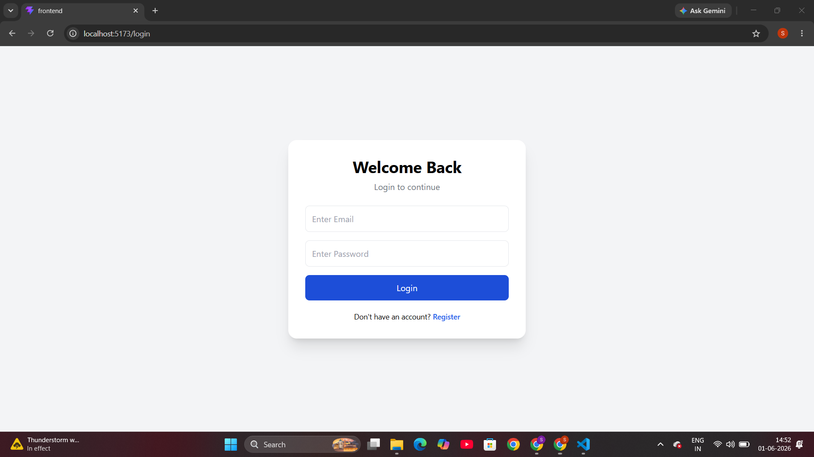
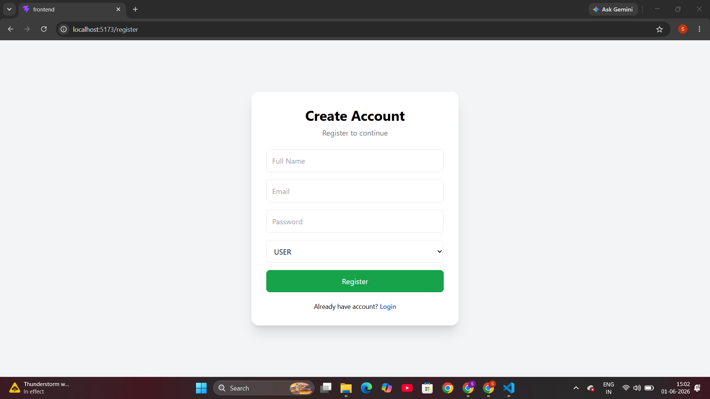
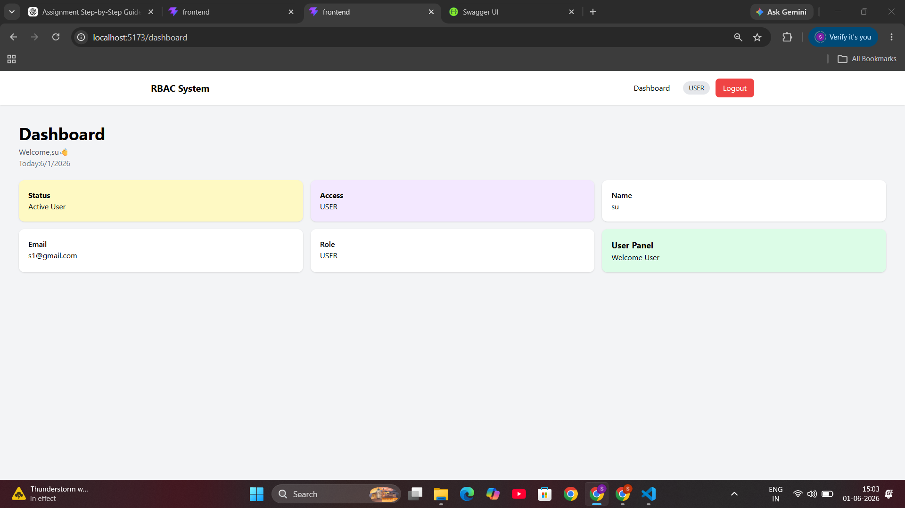
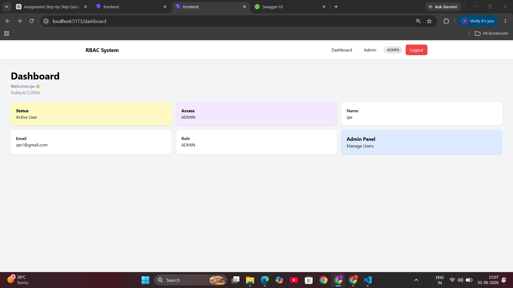
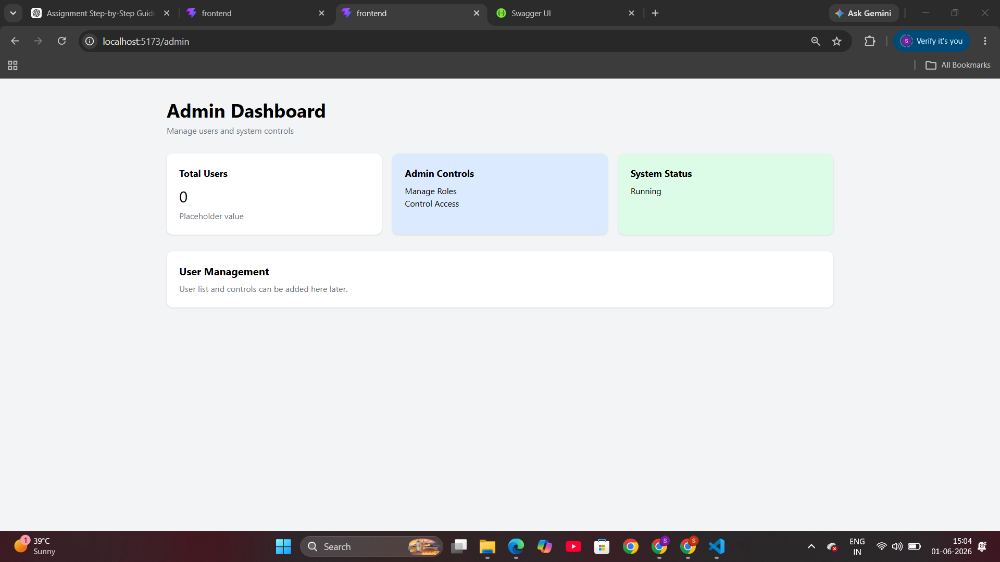
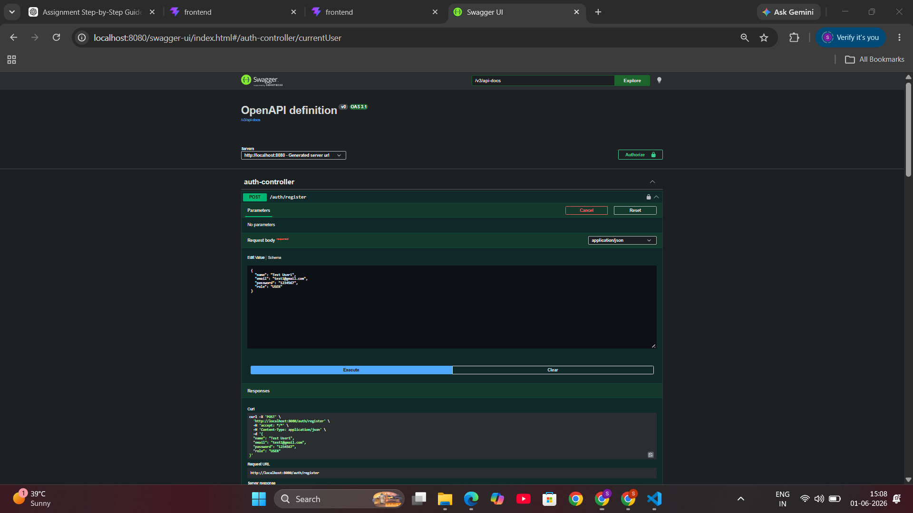
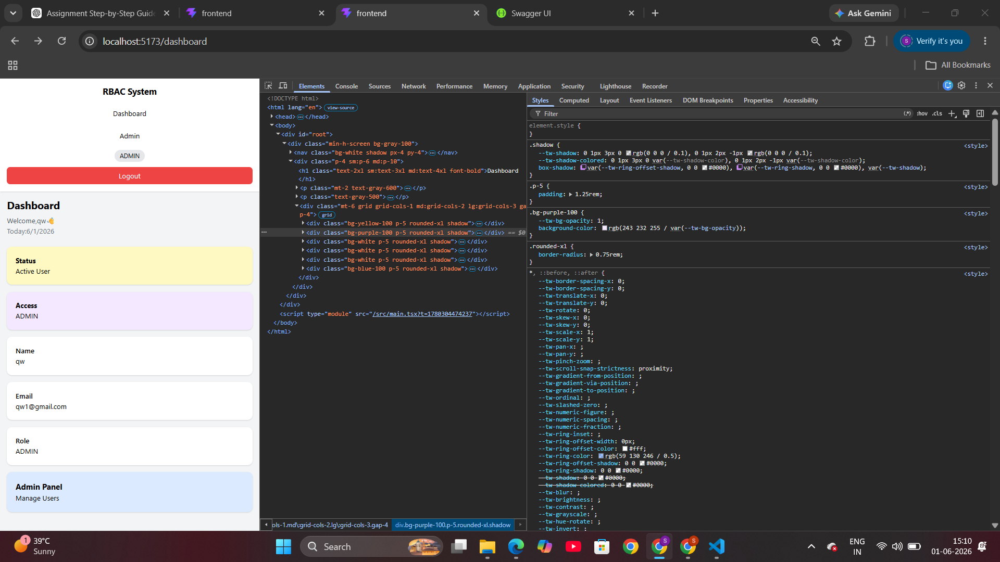

# RBAC Authentication System

A Full Stack Role Based Authentication System built using Spring Boot, React, JWT Authentication and MySQL. The system provides secure authentication, authorization, protected routes and role-based access control.

---

# Features

✅ User Registration
✅ JWT Authentication
✅ Login / Logout Functionality
✅ Role Based Access Control (RBAC)
✅ Protected Routes
✅ Admin Route Protection
✅ Responsive UI (Mobile / Tablet / Desktop)
✅ Swagger API Documentation
✅ Dashboard with User Information
✅ Admin Dashboard Access Control

---

# Tech Stack

## Frontend

* React
* TypeScript
* Tailwind CSS
* Axios
* React Router DOM

## Backend

* Spring Boot
* Spring Security
* JWT Authentication
* MySQL
* Swagger OpenAPI
* Maven

---

# Project Structure

```text
frontend/
├── src/
│   ├── pages/
│   ├── components/
│   ├── services/

backend/
├── src/
├── pom.xml
```

---

# Setup Instructions

## Backend Setup

Open backend folder:

```bash
cd backend
```

Run backend:

```bash
.\mvnw.cmd spring-boot:run
```

Backend URL:

```text
http://localhost:8080
```

---

## Frontend Setup

Open frontend folder:

```bash
cd frontend
```

Install dependencies:

```bash
npm install
```

Run frontend:

```bash
npm run dev
```

Frontend URL:

```text
http://localhost:5173
```

---

# API Endpoints

| Method | Endpoint       | Description          |
| ------ | -------------- | -------------------- |
| POST   | /auth/register | Register User        |
| POST   | /auth/login    | Login User           |
| GET    | /auth/me       | Current User         |
| GET    | /admin/*       | Admin Protected APIs |
| GET    | /user/*        | User Protected APIs  |

---

# JWT Authentication Flow

```text
Register User
      ↓
Login
      ↓
JWT Token Generated
      ↓
Store Token in LocalStorage
      ↓
Protected API Access
```

---

# Screenshots

## Login Page

```text

```

## Register Page

```text

```

## Dashboard (USER)

```text

```

## Dashboard (ADMIN)

```text

```

## Admin Page

```text

```

## Swagger Documentation

```text

```

## Mobile Responsive View

```text

```

---

# Deployment Links

## Frontend Deployment

Add Vercel URL Here

## Backend Deployment

Add Render URL Here

---

# Author

Name: Sunidhi Shinde

GitHub:

https://github.com/soniyaritgithub

LinkedIn:

https://www.linkedin.com/in/sunidhishinde/
